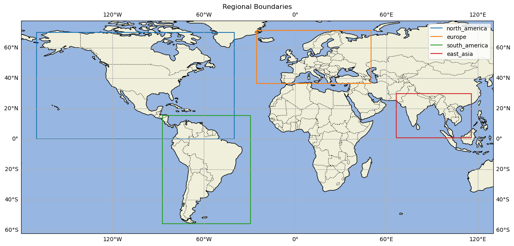

# ERA5 forcing data for the Weather Research and Forecasting (WRF) model

## Summary

This dataset provides ERA5 reanalysis product forcing parameters suitable for immediate ingestion into the Weather Research and Forecasting (WRF) model, i.e., in WRF intermediate data format. The dataset also includes global timeseries data from 2000-01 to present for key meteorological variables for the wind industry. Data is updated monthly.

## About

The ERA5 reanalyis product (https://www.ecmwf.int/en/forecasts/dataset/ecmwf-reanalysis-v5) is the leading global reanalysis product available today. For the wind energy industry in particular, ERA5 consistenly outperforms other products when compared against observations. Furthermore, ERA5 is most commonly used to provide boundary forcings to mesoscale modeling, notably for the open-source, community-supported, and industry-trusted Weather and Research Forecasting (WRF) model. Processing the ERA5 data into the format required by WRF can be onerous. With this open dataset, we aim to greatly simplify the process and allow users to more quickly and efficiently launch WRF simulations using ERA5 reanalysis as forcing.

## Data

### Overview

Two core data products are offered in this dataset

- **Boundary forcing for WRF**: this includes WRF intermediate files from 2000-01 to present every 3 hours for the regions defined in the figure below. New regions can be added within 2 weeks if requested by the community. Data are separated into surface and pressure level files with the following variables and heights included:
    - Pressure Levels (hPa): 1, 2, 3, 5, 7, 10, 20, 30, 50, 70, 100, 125, 150, 175, 200, 225, 250, 300, 350, 400, 450, 500, 550, 600, 650, 700, 750, 775, 800, 825, 850, 875 900, 925, 950, 975, 1000
    - Pressure level variables: ['geopotential', 'relative_humidity', 'specific_humidity',
    'temperature', 'u_component_of_wind', 'v_component_of_wind']
    - Surface variables: ['10m_u_component_of_wind','10m_v_component_of_wind','2m_dewpoint_temperature',
        	    		'2m_temperature','land_sea_mask','mean_sea_level_pressure',
	            		'sea_ice_cover','sea_surface_temperature','skin_temperature',
        	    		'snow_depth','soil_temperature_level_1','soil_temperature_level_2',
            			'soil_temperature_level_3','soil_temperature_level_4','surface_pressure',
            			'volumetric_soil_water_layer_1','volumetric_soil_water_layer_2','volumetric_soil_water_layer_3',
            			'volumetric_soil_water_layer_4']
- **Global timeseries data**: Global hourly timeseries data at 0.25 degree resolution, with each coordinate saved as a separate CSV file. As of May 2024, the only variables included are 100-m wind speed, 100-m wind direction, 2-m temperature, and surface pressure.



### Format and structure

The WRF intermediate data is stored in various sub-folders with the following structure: {region}/{year}/{month}. For example, 

```
s3://era5-for-wrf/north_america/2010/05/ERA5*
```

The global timeseries data are stored with the following structure: {grid_cell_id}/timeseries.csv. For example:

```
s3://era5-for-wrf/global_single_level/cells/0000010/timeseries.csv
```

Grid cell IDs range from 1 to 1038240, each corresponding to a lat/lon coordinate as specified in the csv file located here:

```
s3://era5-for-wrf/era5_global_gids.csv
```

Refer to the tutorial section for an example of finding a GID and downloading data.

## Data Access

### Python

Data can be accessed in Python using the Boto 3 library. Please see our tutorial examples for insights on how to download data using this method
For more examples see the Tutorials below.

### AWS CLI

The [AWS CLI](https://docs.aws.amazon.com/cli/latest/userguide/getting-started-install.html) can also be used to interact with the data, e.g.:

```
aws s3 ls s3://era5-for-wrf/
    PRE east_asia/
    PRE europe/
    PRE global_single_level/
    PRE hrrr_conus/
    PRE north_america/
    PRE south_america/
    PRE southeast_asia_north/
```
### Veer's Web Interface

Global timeseries data can also be accessed via a global map-based interface. Head to https://earth.veer.eco to learn more.

## License

CC BY-SA 4.0

